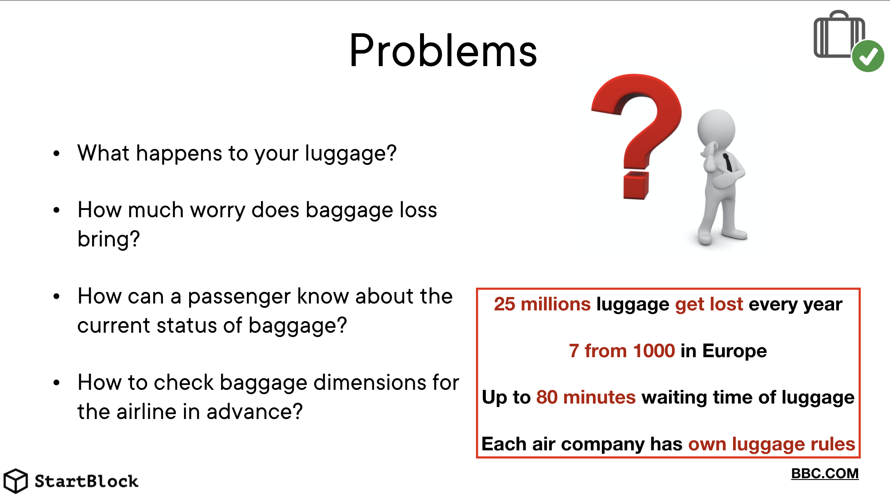
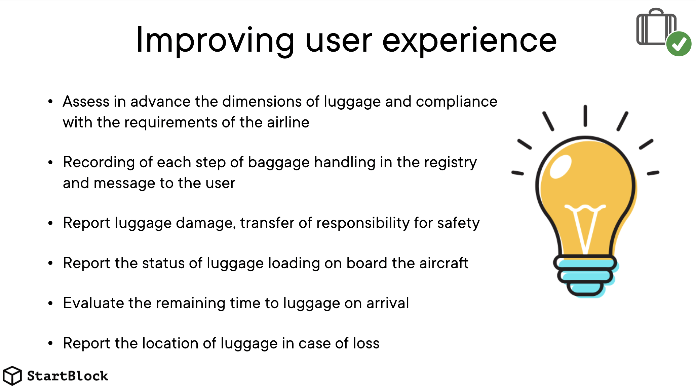
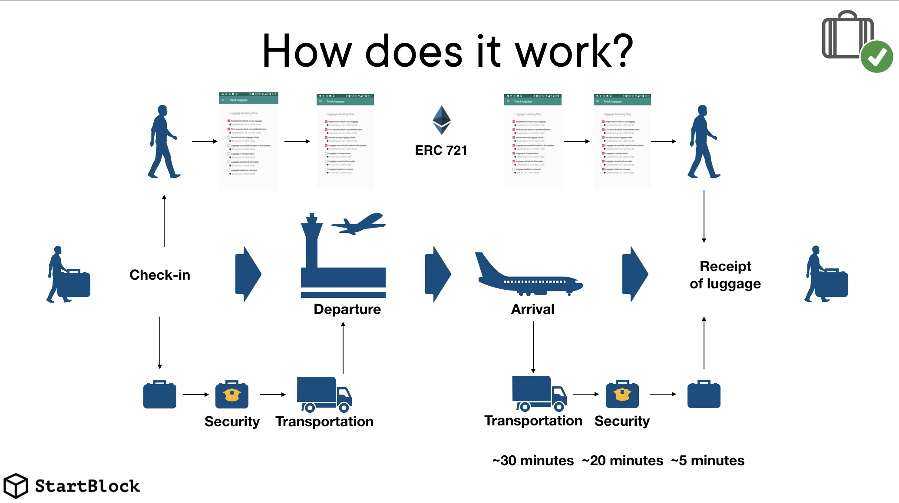
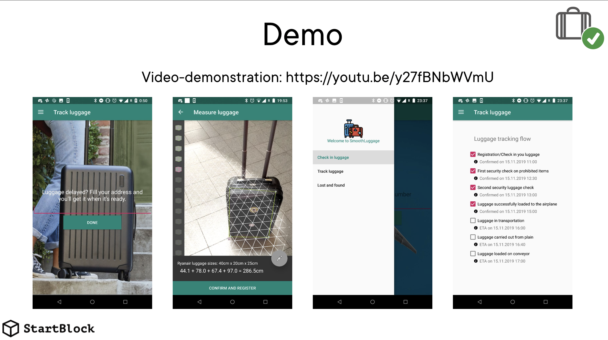
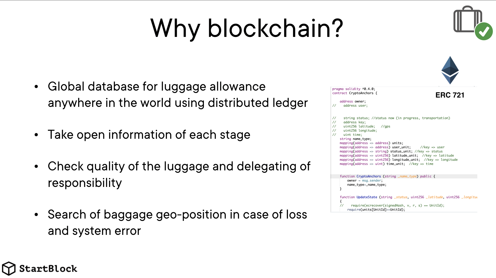
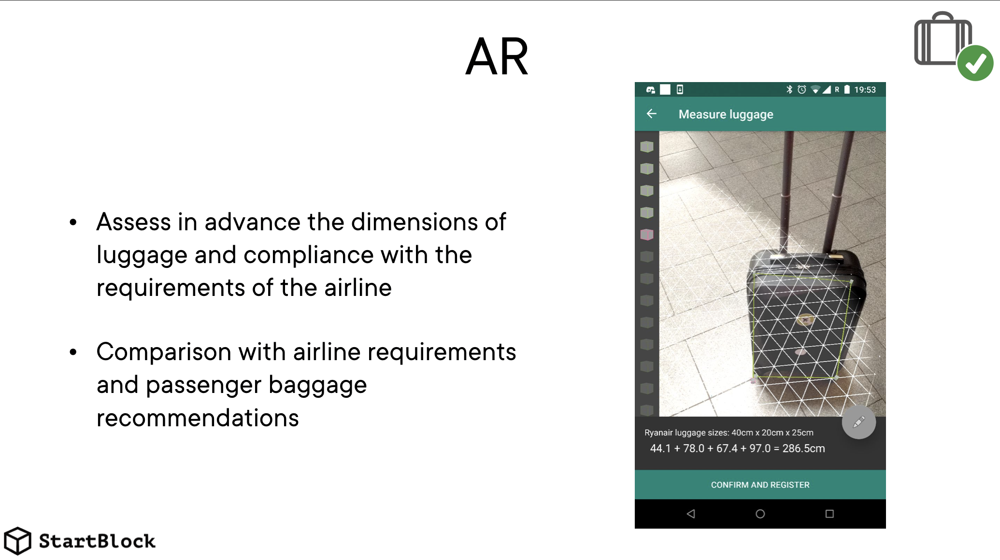
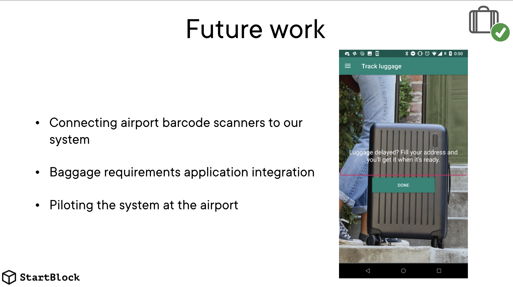

# SmoothLuggage

A system for scanning and tracking your luggage, improving the user experience.

# Structure

<ol type="1" style="font-size: x-large;">
  <li> <a href="https://github.com/AntonPecherkin/SmoothLuggage#problems">Problems</a>
  <li> <a href="https://github.com/AntonPecherkin/SmoothLuggage#solution">Solution</a>
  <li> <a href="https://github.com/AntonPecherkin/SmoothLuggage#how-does-it-work">How does it work?</a>
  <li> <a href="https://github.com/AntonPecherkin/SmoothLuggage#user-application">User application</a>
  <li> <a href="https://github.com/AntonPecherkin/SmoothLuggage#why-blockchain">Why blockchain?</a>
  <li> <a href="https://github.com/AntonPecherkin/SmoothLuggage#why-ar">Why AR?</a>
  <li> <a href="https://github.com/AntonPecherkin/SmoothLuggage#installation">Installation</a>
<li> <a href="https://github.com/AntonPecherkin/SmoothLuggage#future-work">Future work</a>
<li> <a href="https://github.com/AntonPecherkin/SmoothLuggage#finally">Finally</a>
<li> <a href="https://github.com/AntonPecherkin/SmoothLuggage#team">Team</a>
</ol>

# Problems

- 25 millions of pieces of luggage get lost every year
- Airlines are tightening the restrictions on how much luggage you can bring in the cabin with you, encouraging flyers to check in their bags instead. 
- Packing according to airline restrictions can be a pain. 
- Up to 80 minutes waiting time of luggage
- Passengers want to control the status of their luggage and know the location

# Solution

- Assess in advance the dimensions of luggage and compliance with the requirements of the airline
- Recording of each step of baggage handling in the registry and message to the user
- Report luggage damage, transfer of responsibility for safety
- Report the status of luggage loading on board the aircraft
- Evaluate the remaining time to luggage on arrival
- Report the location of luggage in case of loss

# How does it work?

Passenger:
1. Uses scanning his baggage using the application and camera
2. Selects baggage plan and pays service fees suitable for the requirements of a particular airline
3. Checks in for a flight, synchronizes the application with a barcode and handles luggage
4. Gets information about each stage in the inspection and loading of his baggage
5. Stays calm as luggage loaded on board
6. Upon arrival, receives an estimate of the time to baggage claim and current status
7. In case of loss, receives a luggage geo-position and delivery instructions

Staff:
1. Receives baggage and accepts responsibility until the next step.
2. Enters baggage inspection / inspection information
3. Transports and transfers to the next participant in the chain

Anyone:
1.Scans a barcode and sends a transaction with a baggage geoposition in case of loss

# User application

# Why blockchain?

- Global database for luggage allowance anywhere in the world using distributed ledger
- Take open information of each stage
- Check quality of the luggage and delegating of responsibility 
- Search of baggage geo-position in case of loss and system error

# Why AR?

- Assess in advance the dimensions of luggage and compliance with the requirements of the airline
- Comparison with airline requirements and passenger baggage recommendations

# Future work

- Connecting airport barcode scanners to our system
- Baggage requirements application integration
- Piloting the system at the airport

# Finally

We have implemented the following functionality:
- AR for measuring baggage dimensions and comparing with airline requirements
- A mobile Android application for a passenger with the function of tracking baggage status, searching and estimating the time before baggage claim
- Smart contract for writing information to the Ethereum blockchain
- An application for scanning barcodes and recording current information in the blockchain

# Team

